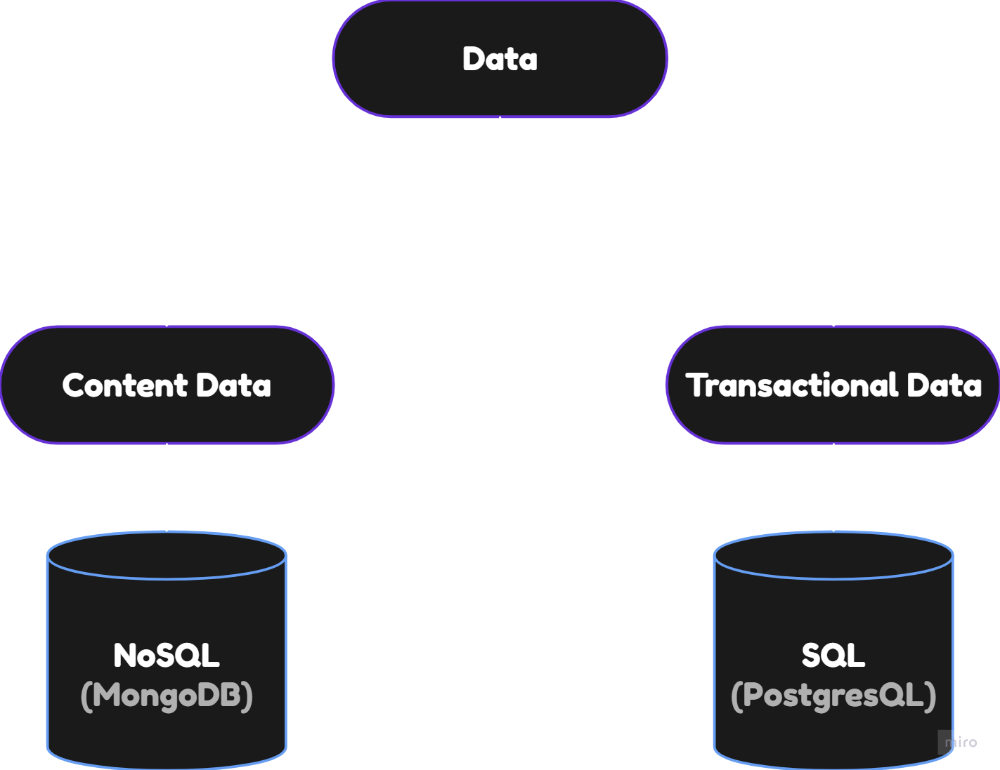
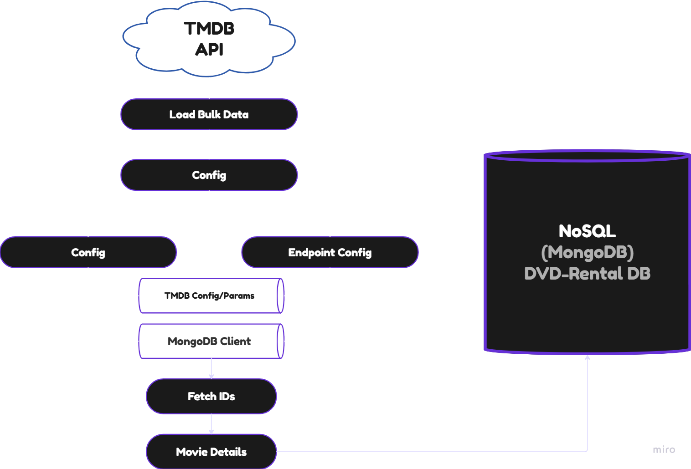

<table align="center">
  <tr>
    <td></td>
    <td><h1>Online DVD-Rental Store 🎬</h1></td>
  </tr>
</table>

<h3 align="center">Data Pipelines</h3>


<p align="center">
  🌌 This repo is a part of an end-to-end concept project based on <b>Data Engineering</b>.  
  In this repo we will store all the data pipelines needed in the <b>DVD-Rental</b> project.
</p>

---

<p align="center">
  <a>
    
  </a>
  <a href="https://python.org">
    
  </a>
</p>

## 📖 Table of Contents
1. [About the Repository](#about-the-repository)
2. [Project Structure](#project-structure)
3. [Content Data](#content-data)
4. [Setup Instructions](#setup-instructions)

## 📌 About the Repository
This repository is a part of a bigger project called DVD-Rental. It contains all the data pipelines of the major project.
The dataflow of the **DVD-Rental** project is mainly divided into two parts:-

- ***Content Data:*** This part of the data contains all the metadata of the content that is supposed to be rendered on the frontend of the project.
Data Source: 
<a href="https://developer.themoviedb.org/docs/getting-started">The Movie DB</a>. 
As this data is document based we have used NoSQL Database i.e. **MongoDB**.

- ***Transactional Data:*** This part of the data contains all the transactional data that is going to be collected form the user end. For Example: User Credentials, User Navigation, Purchases, Sessions, Content Preference, Payment Transactions, etc. . As this data is structured and tabular we have used SQL Database i.e. **PostgresQL**.

This repository controls the complete dataflow of the project and it also contains all the data pipelines that loads or updates the data. 
<p align="center">
  
</p>

## 💼 Project Structure
```bash
📁 dvd-rental
├── 📁 data
│   ├── 📁 content_data
│   │   ├── 📁 changes_pipeline # work in progress
│   │   ├── 📁 load_bulk_data
│   │   │    ├── 📁 config
│   │   │    │    ├── 🐍 __init__.py
│   │   │    │    ├── 🐍 config.py
│   │   │    │    └── 🐍 endpoint_config.py
│   │   │    ├── 📁 fetch_ids
│   │   │    │    ├── 🐍 __init__.py
│   │   │    │    ├── 🐍 fetch_ids.py
│   │   │    │    └── 🐍 run_fetch_ids.py
│   │   │    ├── 📁 load_movie_details
│   │   │    │    ├── 🐍 __init__.py
│   │   │    │    ├── 🐍 fetch_movie_details.py
│   │   │    │    └── 🐍 run_movie_details.py
│   │   │    └── 🐍 __init__.py
│   │   ├── 🐍 __init__.py
│   │   └── 🐍 base_log.py
├── 📁 readme
│   └── 📁 imgs # images for readme file nothing important
├── ⚙ .env
└── 🙈 README.md
```
## ⚙ Environment Variables
```bash
# In your root dir you must have these environment varibales configured

# db credentials
DB_HOST=<postgres_host>
DB_PORT=<port>
DB_NAME=<db_name>
DB_USER=<username>
DB_PASSWORD=<password>

MONGO_USER=<mongo_db_user>
MONGO_PASSWORD=<mongo_db_password>
MONGO_HOST=<mongo_db_host>
MONGO_PORT=<mongo_db_port>
MONGO_DB=<mongo_db_name>

# TMDB API
TMDB_API_ACCESS_TOKEN=<your_api_access_token>
TMDB_API_KEY=<your_api_key>

# Data Warehouse - BigQuery (work in progress)
GOOGLE_APPLICATION_CREDENTIALS=<path_to_bq_service_account_credentials_file>
BQ_PROJECT_ID=<project_id>
BQ_DATASET_ID=<dataset_id>
```

> The base_log.py contains the Logger module which will maintain all the logs in the tmdb_logs dir (It has not been pushed on github - check `.gitignore`).


## 💾 Content Data
<p align="center">
  
</p>

The content data package currently contains the <code>Load Bulk Data</code> package, which is responsible for fetching and loading content data in bulk for populating our database initially. This is probably a one time process.

The <code>Load Bulk Data</code> contains the <code>config</code> package which is responsible for handling all the configurations like: API Access, MongoDB Client, and API Endpoint Parameters. This package is created to keep the secrets out of the source code.

### Methods in config.py
```python
from content_data.load_bulk_data.config.config import Config

config = Config()
url, headers, default_params = config.get_tmdb_config(endpoint:str, type:str) 
"""
Information regarding endpoint and type is mentioned below in the endpoint_config.py
"""

"""
We can dynamically set the parameters that we want, using the set_tmdb_params method
"""
dynamic_params = {
  "page": int,
  "primary_release_date.gte": str,
  "primary_release_date.lte": str
}
set_tmdb_params(params=default_params, **dynamic_params)

# get MongoDB Database
db = get_mongo_db() # creds should be present in .end, read doc string.

```

### Endpoint Config
```python
# Here is an example of the endpoint config of the TMDB 
endpoint_config = {
    "base_url": "https://api.themoviedb.org/3",
    "endpoints":{
        "endpoint":{
            "type":{
                "path": "/discover/movie",
                "headers": {
                    "Accept": "application/json"
                },
                "default_params": {
                    "include_adult": True,
                    "include_video": True,
                    "page": "{{page}}",
                    "primary_release_date.gte": "{{start_date}}",
                    "primary_release_date.lte": "{{end_date}}",
                    "api_key": "{{tmdb_api_key}}"
                }
            }
        }
    }
}
```
> For more information on the endpoints visit: https://developer.themoviedb.org/reference/intro/getting-started

To get all the information of the movies or tv_shows we need their TMDB ids. Hence to fetch these IDs I have created a package called fetch_ids that will help in fetching all the movie IDs year wise.

### Methods in fetch_ids.py
```python
from .fetch_ids import FetchIDs
# This module contains the methods to fetch movie_ids for a single input

fetch_ids = FetchIDs(page=int, start_date=str, end_date=str, type=str)
fetch_ids.get_total_pages() # to get the total pages that are there in the given date range

fetch_ids.fetch_ids() # to fetch the ids on each page

```

### run_fetch_ids.py
```python
# This module uses the methods to fetch ids for a whole year
year = 2024
obj = RunFetchIDs(year=year, type="tv_shows")
ids = obj.fetch_yearly_data()

```

Once we have fetched the ids we can fetch the details, images, videos, and credits of those movies or tv_shows using the <code>load_movie_details</code> package.

### Methods in fetch_movie_details.py
```python
# This package uses asyncio to fetch all the details at once: details, images, videos, and credits 

import asyncio
from .fetch_movie_details import MovieDetails

movie_details = MovieDetails(movie_id:int=None, client: httpx.AsyncClient=None)
data = await movie_details.get_compiled_data()

# We should use the methods of this module via the RunMovieDetails module which is present in the run_movie_details.py

from content_data.load_bulk_data.load_movie_details.run_movie_details import RunMovieDetails
movie_ids = [155]

obj = RunMovieDetails(movie_ids=movie_ids)
movies = asyncio.run(obj.main())

script_dir = os.path.dirname(os.path.abspath(__file__))
output_path = os.path.join(script_dir, "movie_details.json")
with open(output_path, "w", encoding="utf-8") as f:
    f.write('{"results": ')
    json.dump(movies, f, indent=4)
    f.write('}')
```

## 🛠️ Setup Instructions
### 1️⃣ Clone the Repository
```bash
git clone https://github.com/Kartikrast/dvd-rental-data-pipelines.git
```
### 2️⃣ Create a Virtual Environment (Optional but Recommended)
```bash
python -m venv venv
source venv/bin/activate   # On Linux/Mac
venv\Scripts\activate      # On Windows
```
### 3️⃣ Install Dependencies
```bash
pip install -r requirements.txt
```
### 4️⃣ Setup your mongoDB
We only need a dummy DB to be configured in the config.py

### 5️⃣ Get TMDB API Key and Access Token
Visit: https://developer.themoviedb.org/reference/intro/getting-started to get the API credentials, it's free.

### 6️⃣ Set Up Environment Variables

Create a .env file in the root directory and add the required environment variables:

See the [⚙ Environment Variables](#environment-variables) section for details.

### 7️⃣ Setup VPN if you are from India
The TMDB API doesn't work on Indian Network hence you will need a VPN to use the API.

### 8️⃣ Open run_fetch_ids.py and run the command
> Check the year set
```python
if __name__ == "__main__":
    year = 2024
    """Step-1: Fetch movie_ids for the year 2024"""
    obj = RunFetchIDs(year=year, type="tv_shows")
    ids = obj.fetch_yearly_data()

```

> Run this command
```bash
python -m content_data.load_bulk_data.fetch_ids.run_fetch_ids
```